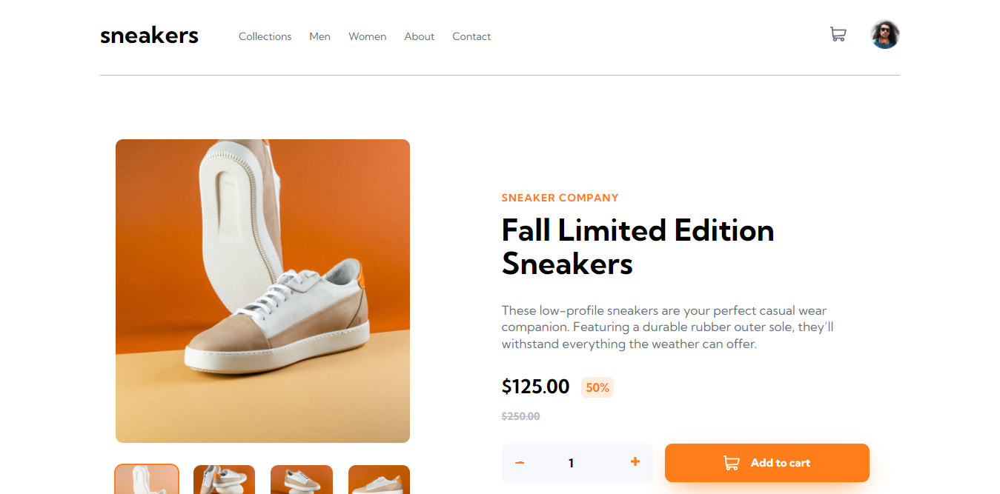

# Frontendmentor-Solution

This repository are used for challenging myself about slicing design from given design. Also, i didnt buy the pro version from this websites, therefore i dont have access to any design files relying only on my vision and approximation

| **Difficulty** | **Challenges** | **Publish Date** |
|---|---|---|
| NEWBIE | [3 Column Preview Card Component](#3-column-preview-card) &nbsp; &nbsp; &nbsp; &nbsp;| 07 November 2021 |
| NEWBIE | [Stats Preview Card Component](#stats-preview-card-component) &nbsp; &nbsp; &nbsp; &nbsp;| 02 November 2021 |
| NEWBIE | [NFT Preview Card Component](#nft-preview-card-component) &nbsp; &nbsp; &nbsp; &nbsp;| |
| NEWBIE | [Single Price](#single-price-grid) &nbsp; &nbsp; &nbsp; &nbsp;| 03 January 2022 |
| NEWBIE | [Ping Single Column Coming Soon Page](#ping-single-column-coming-soon-page) &nbsp; &nbsp; &nbsp; &nbsp;| |
| NEWBIE | [Order Summary Component](#order-summary-Component) &nbsp; &nbsp; &nbsp; &nbsp;| 14 November 2021 |
| NEWBIE | [Social Proof Section](#social-proof-section) &nbsp; &nbsp; &nbsp; &nbsp;| |
| NEWBIE | [Intro Component](#intro-component-with-signup) &nbsp; &nbsp; &nbsp; &nbsp;| 06 January 2022 |
| NEWBIE | [FAQ Accordion Card](#faq-accordion-card) &nbsp; &nbsp; &nbsp; &nbsp;| 19 January 2022 |
| JUNIOR | [Pricing-Component-With-Toggle](#pricing-component-with-toggle) &nbsp; &nbsp; &nbsp; &nbsp;| |
| JUNIOR | [Fylo Data Storage Component](https://www.frontendmentor.io/solutions/fylodatastoragecomponentmaster-NVJtBst4y) &nbsp; &nbsp; &nbsp; &nbsp;| |
| JUNIOR | [Tip Calculator App](#tip-calculator-app) &nbsp; &nbsp; &nbsp; &nbsp;| 27 December 2021 |
| JUNIOR | [Testi Challenge](#testimonials-grid-section) &nbsp; &nbsp; &nbsp; &nbsp;| 09 January 2022 |
| JUNIOR | [Sunnyside Agency Landing Page](#sunnyside-agency-landing-page) &nbsp; &nbsp; &nbsp; &nbsp;| 17 January 2022 |
| INTERMEDIATE | [Ecommerce Product Page](#ecommerce-product-page) &nbsp; &nbsp; &nbsp; &nbsp;| 27 January 2022 |

### 3 Column Preview Card

Preview Site: https://titocs.github.io/3-column-preview-card-component-main/  
Code Solution: https://github.com/titocs/3-column-preview-card-component-main  
What I Learn:  
Frameworks: -

### Stats Preview Card Component

Preview Site: https://titocs.github.io/stats-preview-card-component/  
Code Solution: https://github.com/titocs/stats-preview-card-component  
What I Learn:  
Frameworks: -

### NFT Preview Card Component

Preview Site: https://titocs.github.io/nft-preview-card-component-main/  
Code Solution: https://github.com/titocs/nft-preview-card-component-main  
What I Learn:  
Frameworks: -

### Single Price Grid

Preview Site: https://titocs.github.io/single-price-component/  
Code Solution: https://github.com/titocs/single-price-component  
What I Learn: responsive.
Frameworks: -

### Ping Single Column Coming Soon Page

Preview Site: https://titocs.github.io/ping-coming-soon-page-master/  
Code Solution: https://github.com/titocs/ping-coming-soon-page-master  
What I Learn:  
Frameworks: -

### Order Summary Component

Preview Site: https://titocs.github.io/order-summary-component-main/  
Code Solution: https://github.com/titocs/order-summary-component-main  
What I Learn:  
Frameworks: -

### Social Proof Section

Preview Site: https://titocs.github.io/social-proof-section-master/  
Code Solution: https://github.com/titocs/social-proof-section-master  
What I Learn:  
Frameworks: -

### Intro Component With Signup

Preview Site: https://titocs.github.io/intro-signup/  
Code Solution: https://github.com/titocs/intro-signup  
What I Learn: displaying error when the input doesnt match.
Frameworks: -

### Faq Accordion Card

Preview Site: https://titocs.github.io/FAQ-accordion/  
Code Solution: https://github.com/titocs/FAQ-accordion  
What I Learn: making box animation, transform origin.  
Frameworks: -

### Pricing Component With Toggle

Preview Site: https://titocs.github.io/Pricing-Component-With-Toggle/  
Code Solution: https://github.com/titocs/Pricing-Component-With-Toggle  
What I Learn: change the price when toggle button clicked using innerHTML modification.

### Tip Calculator App

Preview Site: https://titocs.github.io/Tip-Calculator-App/  
Code Solution: https://github.com/titocs/Tip-Calculator-App  
What I Learn: Implementing basic arithmetic operation with vanillaJS by real time with "input" eventListener.

### Testimonials Grid Section

Preview Site: https://titocs.github.io/testimonials-grid-section/  
Code Solution: https://github.com/titocs/testimonials-grid-section

### Sunnyside Agency Landing Page

Preview Site: https://titocs.github.io/sunnyside-agency-landing-page/  
Code Solution: https://github.com/titocs/sunnyside-agency-landing-page  
What I Learn: displaying mobile menus, using after/before pseudoclass for making border-bottom in "LEARN MORE" text and make it responsive & hover.

### Ecommerce Product Page

Preview Site: https://titocs.github.io/Ecommerce-Product-Page/  
Code Solution: https://github.com/titocs/Ecommerce-Product-Page  
What I Learn: making animation for displaying mobile menus and displaying lightbox, close all menus if the document is clicked using stopPropagation method, event binding, set the minus margin to hovered element so it doesnt move.  
Frameworks: -
